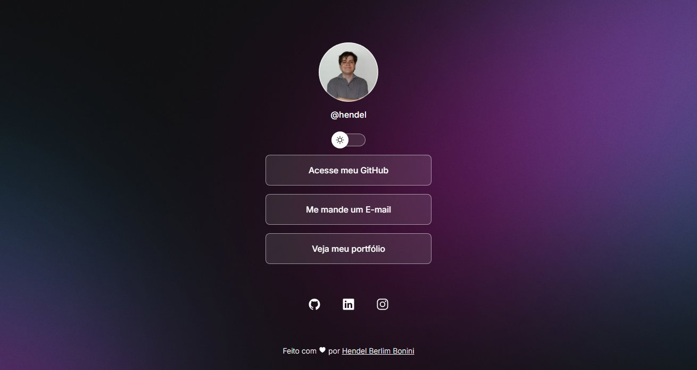

<h1 align="center">Like Linktree</h1>

A project made together with the RocketSeat community to learn web technologies

You can try it yourself by entering
<a href="https://mixterioh.github.io/Like-Linktree/">here</a>.

## 🚀 Technologies

This project was made using the following technologies:  

-HTML and CSS 
-JavaScript 
-Git and GitHub 
-Figma

## 🖥️ Project

  Like Linktree is a link aggregator that works like a digital business card

## Layout

You can view the project layout at the following link
<a href="https://www.figma.com/community/file/1187422022288947321">https://www.figma.com/community/file/1187422022288947321</a>
 
A Figma account is required to access it.

## License

This project is under the MIT license.

